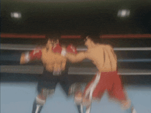

<table style="border-collapse: collapse; border: 0;">
  <tr style="border: 0;">
    <td width="22%" align="center" style="border: 0;">
      
    </td>
    <td width="83%" style="border: 0;">
      <h3>BoxingVI: A Multi-Modal Benchmark for Boxing Action Recognition and Localization</h3>
      <p>
        📄 <strong>Paper available at:</strong>
        <a href="https://arxiv.org/pdf/2511.16524">https://arxiv.org/pdf/2511.16524</a>
      </p>
    </td>
  </tr>
</table>

🥊BoxingVI is a large-scale, richly annotated benchmark dataset specifically created to advance research in vision-based analysis of boxing actions. The dataset comprises 6,915 finely segmented punch clips extracted from 20 unedited YouTube boxing videos, covering six distinct punch types:

**1) Cross**

**2) Jab**

**3) Lead Hook**

**4) Lead Uppercut**

**5) Rear Hook**

**6) Rear Uppercut**

This benchmark is developed to address the lack of domain-specific datasets in combat sports and is intended for tasks such as action recognition, temporal localization, pose-based classification, and skill assessment.# BoxingX-A-Multi-Modal-Benchmark-for-Boxing-Action-Recognition-and-Localization

**🗃️Dataset Features**

Total Clips: 6,915

- Training: 5,513 (Subjects S1–S15)

- Validation: 1,402 (Subjects S16–S20)

Punch Types (6 classes):

- Cross, Jab, Lead Hook, Lead Uppercut, Rear Hook, Rear Uppercut

Videos: 20 unedited YouTube videos

- 18 athletes (11 male, 7 female)

- Real-world, monocular RGB recordings

Annotations:

- Temporal punch boundaries

- Per-clip class labels

- Frame-wise 2D pose keypoints (AlphaPose)

Pose Tracking:
Annotation_file/ # Punch annotations with temporal boundaries and class labels
- Center-of-mass tracking

- Person of interest selected and tracked across frames

Pose Normalization:

- Keypoints scaled to video dimensions

- Poses padded to max 25 frames (30 fps)


## The pose estimations from the RGB videos are extracted using the [**AlphaPose**](https://github.com/MVIG-SJTU/AlphaPose?tab=readme-ov-file) model, and the estimated poses follow the [**COCO format**](https://cocodataset.org/#format-data).
## 📂 Dataset Structure
```bash
Dataset/
├── Annotation_files 
├── RGB_videos 
└── Skeleton_data
```
The dataset is organized into the following format:

- The **`Annotation_file`** contains punch metadata in the format:  
This information is stored in an Excel (.xlsx) file, where each row in the annotation file corresponds to a single punch clip and follows the structure:
## (start_frame, end_frame, punch_class)

Link to access this dataset.
📥 **[Download Dataset](https://drive.google.com/drive/folders/1Vyl8twJQ1qkqEPwhvfsrJsJ8nLQ92uoy)**

---

## **Citation**

If you use Throwing4 in your research, please cite:

```bibtex
@article{kumar2025boxingvi,
  title={BoxingVI: A Multi-Modal Benchmark for Boxing Action Recognition and Localization},
  author={Kumar, Rahul and Baghel, Vipul and Singh, Sudhanshu and Badatya, Bikash Kumar and Yadav, Shivam and Srinivasan, Babji and Hegde, Ravi},
  journal={arXiv preprint arXiv:2511.16524},
  year={2025}
}
```


